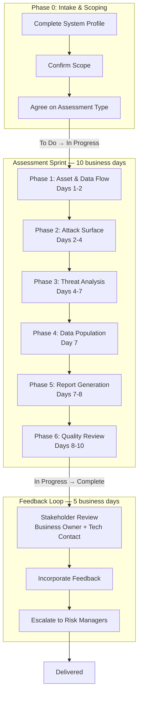

# Threat Modeling Framework

A structured framework for design-level security assessment of vendor relationships, internal applications, and cloud infrastructure. This repository describes my personal methodology, templates, and tools for assessing technical systems as a security architect.

I have developed this approach over some time in the field. I offer this as a methodology you can fork into your own secure architecture practice, if it resonates with you.

For discussion, you can initiate conversation by [email](mailto:celtikill@celtikill.io), and I will entertain well-formed and rational issues.

## What Is Threat Modeling?

Threat modeling is a **design-level security assessment** that evaluates system architecture, data flows, trust boundaries, and integration patterns from the perspective of an attacker,  in order to identify both *weaknesses* and *controls*.

I use it to produce the following artifacts.

### Threat Model Report 

A report primarily identifying architectural attack surfaces and systemic vulnerabilities which surfaces high-risk architectural observations (I use the audit term 'Finding' for effect).

> This report aims to inform architectural decision making, and offer a reference for system influencers (engineers, architects, product owners, executives, etc.)

### Security Requirements

A complete set of mitigating requirements prioritized by risk level -- unless we're threat modeling in support of Third-Party Risk Management (where we offer a simple "proceed/make changes/don't proceed" recommendation).

This set of (mostly) functional requirements aims to inform security feature development, as well as provide a system-specific validation reference for testing.

I root these requirements in standards (ASVS) relevant security scanners often reference.

### Supporting Analysis

An artifact containing the full detail of my analysis, including complete attack trees, threat catalogs, noted assumptions (let's be real, there are always assumptions), reference material, and more.

## What Threat Modeling Is Not

**Vulnerability Assessment** enumerates implementation-level flaws in deployed systems — misconfigurations, unpatched software, default credentials. Threat modeling evaluates design-level architecture and trust boundaries. Vulnerabilities discovered opportunistically during threat modeling are included in the analysis, but systematic enumeration is not the goal.

**Penetration Testing** confirms whether specific attack paths succeed against a live system. Threat modeling identifies *potential* attack surfaces and systemic design weaknesses; penetration testing validates exploitation.

**Governance, Risk & Compliance (GRC)** establishes organizational policies and audit programs. Threat modeling produces technical findings that *inform* GRC programs — it does not audit compliance certifications or assess policy maturity.

## Quick Start

| I want to... | Start here |
|--------------|------------|
| **Understand the methodology** | [`docs/SOP.md`](docs/SOP.md) |
| **Get started quickly** | [`docs/getting-started.md`](docs/getting-started.md) |
| **Choose an assessment type** | [`docs/assessment-type-guide.md`](docs/assessment-type-guide.md) |
| **Request a threat model (hypothetically)** | [`docs/consumer-guide.md`](docs/consumer-guide.md) |
| **Explore attack trees** | [`docs/attack-trees/`](docs/attack-trees/) |
| **See example assessments** | [`examples/`](examples/) |
| **Use the templates** | [`templates/`](templates/) |
| **Understand the repository model** | [`docs/architecture/three-repo-model.md`](docs/architecture/three-repo-model.md) |

### How It Works

## Standards

- **Threat identification:** MITRE ATT&CK, MITRE ATLAS (AI systems)
- **Security requirements:** OWASP ASVS 5.0, OWASP AISVS (systems with AI features)
- **Risk scoring:** Qualitative Likelihood × Impact (High/Medium/Low)

## Examples

See [`examples/`](examples/) for fictional demonstration assessments:

- **Type 1:** ExampleCorp SaaS vendor assessment
- **Type 2:** ExampleAnalytics data pipeline assessment
- **Type 3:** ExampleCloud Infrastructure-Only assessment

## License
This framework is released under [CC BY 4.0](https://creativecommons.org/licenses/by/4.0/). You are free to share and adapt this work with attribution.

## About

This threat modeling framework is maintained as a professional security architecture resource. It represents industry best practices for design-level security assessment.

---

*All example assessments in this repository are fictional and for demonstration purposes only.*
