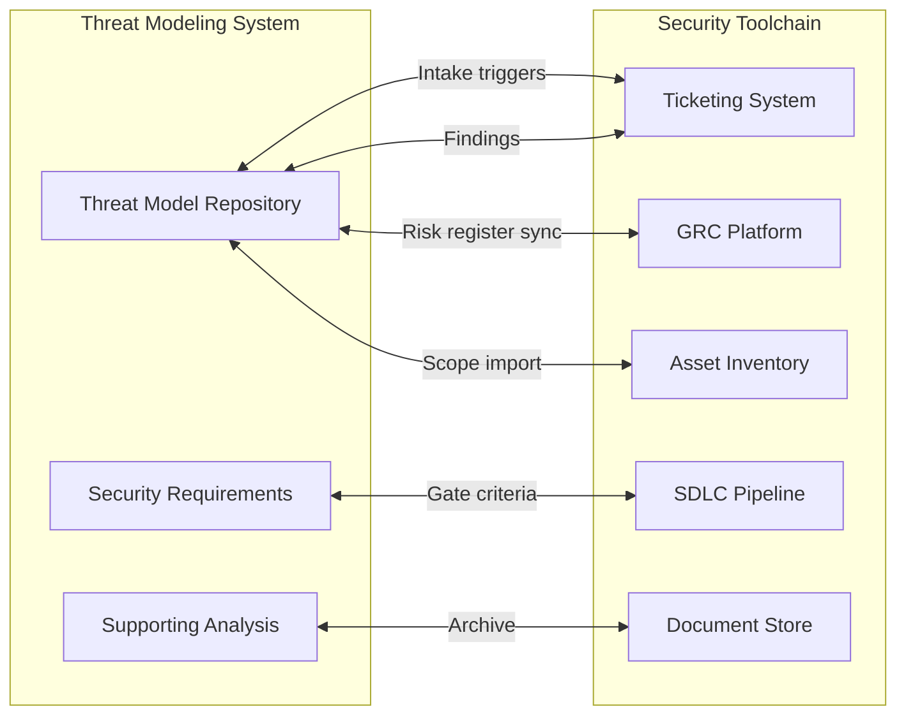

# Enterprise Threat Modeling Adoption Guide

## Overview

This guide helps security architects build and scale a threat modeling program using this framework. It covers integration with existing security tools, organizational design, and phased rollout from initial pilot to enterprise-wide adoption.

**Who should read this:** Security architects tasked with implementing threat modeling as a capability.

**Expected outcome:** A functioning threat modeling program integrated with organizational security processes and tools.

---

## Adoption Maturity Model

Progress through four phases from initial capability to optimized program.

| Phase | Focus | Key Activities | Exit Criteria |
|-------|-------|----------------|---------------|
| **Initial** | Establish capability | Deploy templates; train first analysts; complete 2-3 pilot assessments | At least one full assessment delivered |
| **Defined** | Standardize process | Document org-specific SOPs; create canonical repo; define intake criteria | Repeatable process with clear triggers |
| **Integrated** | Connect to toolchain | Integrate with ticketing system; link to GRC platform; SDLC touchpoints | Threat models feed downstream workflows |
| **Optimized** | Measure and improve | Track metrics; automate where possible; continuous improvement | Demonstrable risk reduction from program |

**Note:** Organization-specific adaptations belong in your canonical repository per the [three-repo model](./architecture/three-repo-model.md).

---

## Integration Architecture

Threat modeling does not operate in isolation. Integrate with existing security tools and processes to maximize value and reduce friction.

### Integration Points

| System | Integration Point | Data Exchange | Implementation Notes |
|--------|-------------------|---------------|----------------------|
| **Ticketing System** | Intake triggers | Request → Assessment issue | Assessments start from approved tickets; findings create remediation tickets |
| **GRC Platform** | Risk register sync | Threat findings → Risk items | High/critical threats feed enterprise risk register |
| **Asset Inventory** | Scope import | Asset metadata → System profile | Pre-populate system profiles from CMDB/asset database |
| **SDLC Pipeline** | Gate criteria | Security requirements → Checklist | Requirements become release gates where applicable |
| **Document Store** | Archive | Deliverables → Long-term storage | Retention per organizational policy |
| **Identity System** | Access control | Role assignments → Permissions | Restrict assessment repo to security architects |

### Integration Sequence

**Phase 1 (Immediate):** Ticketing system intake, document store archive
**Phase 2 (Month 2-3):** Asset inventory import, identity system access
**Phase 3 (Month 4-6):** GRC platform sync, SDLC gate integration

---

## Organizational Model

Define roles, responsibilities, and time commitments for program sustainability.

| Role | Responsibility | Time Allocation |
|------|----------------|-----------------|
| **Program Lead** | Overall program ownership; stakeholder management; metrics reporting | 25-50% FTE |
| **Staff Security Architect** | Methodology oversight; quality review; escalation handling | 10-25% FTE |
| **Threat Model Analyst** | Execute assessments; populate templates; maintain supporting analysis | 75-100% FTE per analyst |
| **Tooling/Automation** | Build integrations; maintain repositories; generate reports | 10-20% FTE |

### RACI Matrix

| Activity | Program Lead | Staff Architect | Analyst | Business Owner | Tooling |
|----------|:------------:|:---------------:|:-------:|:------------:|:-------:|
| **Assessment Phase** |||||
| Define assessment criteria | A | R | C | I | I |
| Execute assessments | I | C | R/A | I | I |
| Review deliverables | C | A | R | C | I |
| **Risk Management Phase** |||||
| Accept/escalate risk | C | C | I | R/A | I |
| Prioritize mitigations | C | C | C | R/A | I |
| **Implementation Phase** |||||
| Implement mitigations | I | C | C | R | A |
| Validate remediation | C | A | R | C | C |

**Legend:** R = Responsible, A = Accountable, C = Consulted, I = Informed

**Note:** Business Owner owns the system and its risk. The threat modeling program produces findings and requirements, but risk acceptance and mitigation implementation accountability sits with system ownership.

---

## Implementation Roadmap

12-week phased rollout from foundation to scale.

### Weeks 1-2: Foundation

| Activity | Deliverable | Owner |
|----------|-------------|-------|
| Set up three-repo structure | Framework forked; canonical repo created; assessment repo initialized | Tooling |
| Identify pilot systems | 2-3 low-risk, well-documented systems selected | Program Lead |
| Assign roles | Analysts hired/assigned; time commitments secured | Program Lead |
| Deploy templates | Templates in canonical repo with org-specific adaptations | Staff Architect |

### Weeks 3-6: Pilot Execution

| Activity | Deliverable | Success Indicator |
|----------|-------------|-------------------|
| Complete pilot assessments | 2-3 full assessments delivered | Stakeholder feedback positive |
| Refine intake process | System profile template adapted | Intake completion rate >80% |
| Validate timeline | 10-day sprint confirmed feasible | No critical delays |
| Document lessons learned | Gap analysis completed | Known issues captured |

### Weeks 7-10: Integration

| Activity | Deliverable | Integration Point |
|----------|-------------|-------------------|
| Connect ticketing | Assessment issues auto-created | Ticketing system |
| Import asset data | System profiles pre-populated | Asset inventory |
| Sync with GRC | Risk items auto-generated | GRC platform |
| Archive to document store | Completed assessments stored | Document store |

### Weeks 11-12: Scale Preparation

| Activity | Deliverable | Metric Target |
|----------|-------------|---------------|
| Train additional analysts | Analysts can execute independently | Time-to-first-solo <2 weeks |
| Define service levels | SLAs documented | Intake response: 2 days |
| Establish metrics dashboard | Automated reporting | Weekly metrics available |
| Communicate service launch | Organization-wide announcement | Intake volume increases |

---

## Metrics and KPIs

Track program health and demonstrate value.

| Metric | Target | Method | Frequency |
|--------|--------|--------|-----------|
| **Coverage** | 100% critical systems assessed | Critical systems inventory vs. baselines | Quarterly |
| **Timeliness** | 90% assessments within 10-day sprint | Sprint completion vs. deadline | Weekly |
| **Quality** | <5% findings invalidated in review | Draft review rework rate | Per assessment |
| **Intake quality** | 80% complete system profiles | Required fields completion rate | Weekly |
| **Integration** | 100% high risks in GRC | High-risk tracking in risk register | Monthly |
| **Throughput** | 1-2 assessments per analyst per month | Completed assessments / analyst / month | Monthly |

---

## Common Pitfalls

| Pitfall | Why It Happens | Mitigation |
|---------|----------------|------------|
| **Assessment backlog** | No clear intake criteria; everything queues for assessment | Define explicit triggers; triage incoming requests |
| **Low-quality intake** | Requestors do not understand required information | Provide system profile template with examples; offer pre-submission review |
| **Findings ignored** | Unclear risk ownership; no governance mechanism to enforce remediation | Establish risk acceptance authority; require documented risk decisions; escalate unresolved high risks per RACI |
| **Analyst burnout** | Unsustainable pace; unclear scope | Maintain 10-day sprint with no exceptions; enforce scope boundaries |
| **Tool fragmentation** | Manual processes; no system integration | Prioritize Phase 3 integrations; automate repetitive tasks |
| **Stakeholder resistance** | Seen as bureaucratic overhead; unclear value | Start with pilot systems where stakeholders are bought in; demonstrate early wins |

---

## Quick-Start Checklist

For teams who need to begin immediately while building the full program:

**Week 1:**
- [ ] Fork framework to organization repository
- [ ] Identify one pilot system with willing stakeholders
- [ ] Assign one analyst and one staff architect
- [ ] Customize system profile template for organization

**Week 2:**
- [ ] Complete first pilot assessment (use full 10-day sprint)
- [ ] Document what worked and what broke
- [ ] Update templates based on lessons learned
- [ ] Present findings to stakeholders

**Ongoing:**
- [ ] Complete one assessment every 2 weeks minimum to maintain momentum
- [ ] Add integrations one at a time (ticketing first)
- [ ] Review metrics monthly

**Do not wait for:**
- Perfect tooling
- Complete training
- Executive approval beyond pilot

---

## Cross-References

| Topic | Reference |
|-------|-----------|
| Assessment methodology | [SOP.md](./SOP.md) |
| Three-repo architecture | [three-repo-model.md](./architecture/three-repo-model.md) |
| Analyst onboarding | [getting-started.md](./getting-started.md) |
| Requestor guidance | [consumer-guide.md](./consumer-guide.md) |
| Templates | [templates/](../templates/) |

---

*This guide provides generic patterns. Organization-specific adaptations belong in your canonical repository per the [three-repo model](./architecture/three-repo-model.md).*
