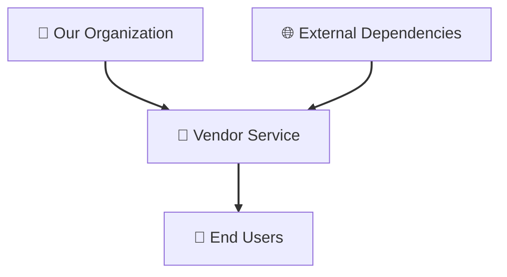
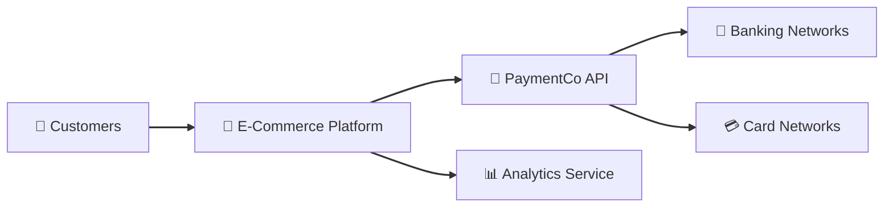
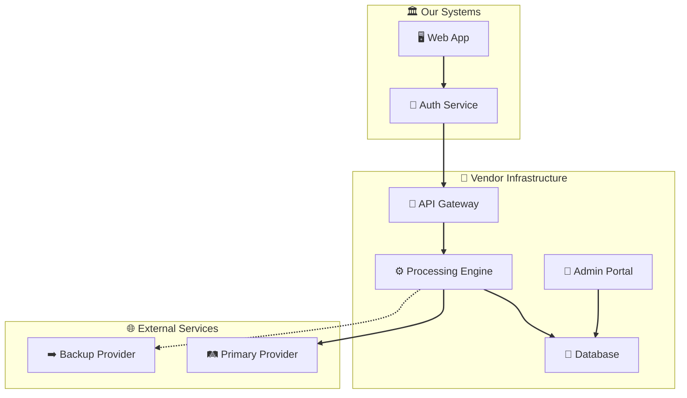
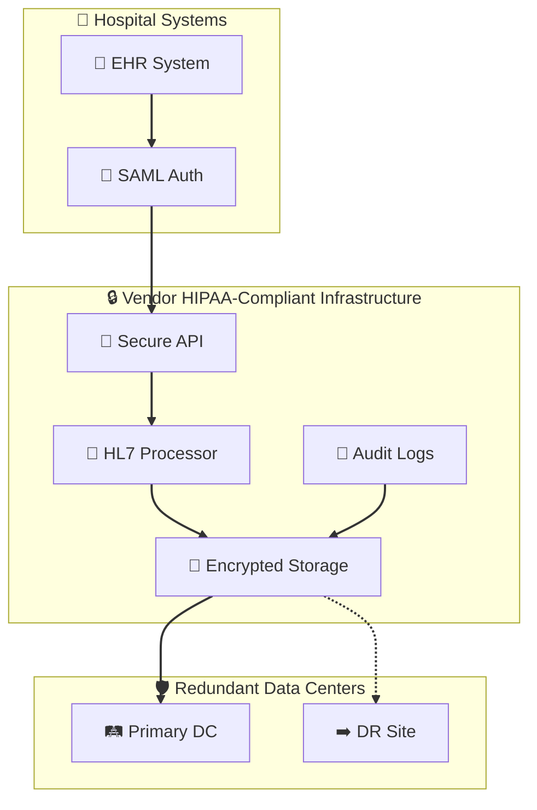

# Threat Modeling Reference Catalog

This document contains reference material for conducting threat model assessments across all assessment types (Third-Party Vendor, Internal Application, Infrastructure-Only). It is a companion to the [SOP](./SOP.md) and is intended to be consulted during analysis, not read end-to-end.

---

## Table of Contents

- [MITRE ATT&CK Technique Catalog](#mitre-attck-technique-catalog)
  - [Mapping Example](#mapping-example)
  - [Techniques by Tactic](#initial-access-ta0001)
    - [Initial Access](#initial-access-ta0001)
    - [Execution](#execution-ta0002)
    - [Persistence](#persistence-ta0003)
    - [Defense Evasion](#defense-evasion-ta0005)
    - [Credential Access](#credential-access-ta0006)
    - [Lateral Movement](#lateral-movement-ta0008)
    - [Collection](#collection-ta0009)
    - [Exfiltration](#exfiltration-ta0010)
  - [Technique Prevalence Mapping](#technique-prevalence-mapping)
  - [AI System Specific Threats (MITRE ATLAS)](#ai-system-specific-threats-mitre-atlas)
  - [Internal Application Techniques (Type 2)](#internal-application-techniques-type-2)
  - [Infrastructure Techniques (Type 3)](#infrastructure-techniques-type-3)
- [Standard Attack Tree Branch Library](#standard-attack-tree-branch-library)
  - [Branch Applicability by Assessment Type](#branch-applicability-by-assessment-type)
  - [Branch 1: Vendor Infrastructure Compromise](#branch-1-vendor-infrastructure-compromise)
  - [Branch 2: Vendor Personnel Threats](#branch-2-vendor-personnel-threats)
  - [Branch 3: Integration Point Exploitation](#branch-3-integration-point-exploitation)
  - [Branch 4: Vendor Business Disruption](#branch-4-vendor-business-disruption)
  - [Branch 5: Infrastructure Component Compromise](#branch-5-infrastructure-component-compromise)
  - [Branch 6: Application Layer Exploitation (Type 2)](#branch-6-application-layer-exploitation-type-2)
  - [Branch 7: Authentication and Authorization Exploitation (Type 2)](#branch-7-authentication-and-authorization-exploitation-type-2)
  - [Branch 8: CI/CD Pipeline Compromise (Type 2)](#branch-8-cicd-pipeline-compromise-type-2)
  - [Branch 9: Pipeline Integration Exploitation (Type 2)](#branch-9-pipeline-integration-exploitation-type-2--pipeline-variant)
  - [Branch 10: IAM Privilege Escalation (Type 3)](#branch-10-iam-privilege-escalation-type-3)
  - [Branch 11: Network Lateral Movement (Type 3)](#branch-11-network-lateral-movement-type-3)
  - [Branch 12: Public Exposure Exploitation (Type 3)](#branch-12-public-exposure-exploitation-type-3)
  - [Branch 13: Credential and Secret Theft (Type 3)](#branch-13-credential-and-secret-theft-type-3)
  - [Branch 14: Logging Evasion (Type 3)](#branch-14-logging-evasion-type-3)
- [AI-Specific Attack Tree Branches (15-21)](#ai-specific-attack-tree-branches-15-21)
  - [Branch 15: AI Training Data Poisoning](#branch-15-ai-training-data-poisoning-ai-2-ai-3)
  - [Branch 16: AI Prompt Injection and Input Manipulation](#branch-16-ai-prompt-injection-and-input-manipulation-ai-2-ai-3)
  - [Branch 17: AI Model Extraction and Theft](#branch-17-ai-model-extraction-and-theft-ai-2-ai-3)
  - [Branch 18: AI Agent and Orchestration Abuse](#branch-18-ai-agent-and-orchestration-abuse-ai-2)
  - [Branch 19: AI Vector Database and Embedding Attacks](#branch-19-ai-vector-database-and-embedding-attacks-ai-2-ai-3)
  - [Branch 20: AI Output Manipulation and Jailbreaks](#branch-20-ai-output-manipulation-and-jailbreaks-ai-2-ai-3)
  - [Branch 21: AI Supply Chain and Model Poisoning](#branch-21-ai-supply-chain-and-model-poisoning-ai-2-ai-3)
- [ASVS 5.0 and AISVS Chapter Reference](#asvs-50-and-aisvs-chapter-reference)
- [Risk Assessment Matrix](#risk-assessment-matrix)
  - [Likelihood Factors](#likelihood-factors-lowmediumhigh)
  - [Impact Factors](#impact-factors-lowmediumhigh)
  - [Risk Matrix](#risk-assessment-matrix-1)
  - [Risk Level Definitions](#risk-level-definitions)
- [Diagram Reference](#diagram-reference)
  - [Emoji Reference](#emoji-for-threat-model-diagrams)
  - [Context Diagram Examples](#context-diagram-examples)
  - [Container Diagram Examples](#container-diagram-examples)
- [Threat Assessment Worksheet Template](#threat-assessment-worksheet-template)

---

## MITRE ATT&CK Technique Catalog

Reference catalog of ATT&CK techniques commonly relevant to threat scenarios across all assessment types. Use this to map identified threats during Phase 3 (Threat Analysis).

### Mapping Example

For threat "Compromised vendor employee credentials accessing customer data":

| Element | Value |
|---------|-------|
| Tactic | Initial Access (TA0001) |
| Technique | Valid Accounts (T1078) |
| Sub-technique | T1078.004 Cloud Accounts |
| Mitigation | M1032 Multi-factor Authentication |
| Detection | DS0028 Logon Session |

### Initial Access (TA0001)

| Technique | Description |
|-----------|-------------|
| T1078 - Valid Accounts | Compromised vendor employee credentials |
| T1190 - Exploit Public-Facing Application | Vendor web application vulnerabilities |
| T1566 - Phishing | Social engineering of vendor personnel |

### Execution (TA0002)

| Technique | Description |
|-----------|-------------|
| T1059 - Command and Scripting Interpreter | Code execution in vendor environment |
| T1203 - Exploitation for Client Execution | Client-side attacks through vendor services |

### Persistence (TA0003)

| Technique | Description |
|-----------|-------------|
| T1078 - Valid Accounts | Persistent access through vendor credentials |
| T1505 - Server Software Component | Backdoors in vendor infrastructure |

### Defense Evasion (TA0005)

| Technique | Description |
|-----------|-------------|
| T1562 - Impair Defenses | Disabling vendor security controls |
| T1070 - Indicator Removal | Log tampering in vendor systems |

### Credential Access (TA0006)

| Technique | Description |
|-----------|-------------|
| T1110 - Brute Force | Attacks on vendor authentication systems |
| T1555 - Credentials from Password Stores | Vendor credential harvesting |

### Lateral Movement (TA0008)

| Technique | Description |
|-----------|-------------|
| T1021 - Remote Services | Movement within vendor infrastructure |
| T1550 - Use Alternate Authentication Material | Token-based lateral movement |

### Collection (TA0009)

| Technique | Description |
|-----------|-------------|
| T1005 - Data from Local System | Data collection from vendor systems |
| T1039 - Data from Network Shared Drive | Accessing shared vendor resources |

### Exfiltration (TA0010)

| Technique | Description |
|-----------|-------------|
| T1041 - Exfiltration Over C2 Channel | Data theft through vendor compromise |
| T1567 - Exfiltration Over Web Service | Using vendor services for data theft |

### Technique Prevalence Mapping

Use technique prevalence to inform likelihood assessment. Prevalence is a population-level measure (how common an attack technique is across all organizations). Adjust likelihood up or down based on system-specific factors: attack surface size, existing controls, threat actor interest, and exposure profile.

| Prevalence | Likelihood Level | Techniques |
|------------|------------------|------------|
| High | High | T1078 Valid Accounts, T1190 Exploit Public-Facing Application, T1566 Phishing |
| Medium | Medium | T1059 Command and Scripting Interpreter, T1110 Brute Force, T1021 Remote Services |
| Low | Low | T1505 Server Software Component, T1550 Use Alternate Authentication Material, APT techniques |

### AI System Specific Threats (MITRE ATLAS)

For vendors providing AI/ML services, reference [MITRE ATLAS](https://atlas.mitre.org/) techniques:

| Technique | Description |
|-----------|-------------|
| AML.T0043 - Craft Adversarial Data | Poisoning training data |
| AML.T0044 - Full ML Model Access | Unauthorized access to model |
| AML.T0051 - LLM Prompt Injection | Manipulating large language models |

**Additional AI Security Resources:**

- [OWASP AI Security and Privacy Guide](https://owasp.org/www-project-ai-security-and-privacy-guide/)
- [NIST AI Risk Management Framework](https://www.nist.gov/itl/ai-risk-management-framework)

### Internal Application Techniques (Type 2)

Techniques particularly relevant to internal application and data pipeline assessments:

| Technique ID | Technique | Relevance |
|-------------|-----------|-----------|
| T1195.002 | Supply Chain Compromise: Software Supply Chain | Compromised dependencies, malicious packages |
| T1059 | Command and Scripting Interpreter | Code injection in custom applications, ETL logic |
| T1548 | Abuse Elevation Control Mechanism | Privilege escalation in application or pipeline |
| T1068 | Exploitation for Privilege Escalation | Application vulnerability exploitation |
| T1565 | Data Manipulation | Transformation logic tampering, data integrity attacks |
| T1530 | Data from Cloud Storage Object | Unauthorized access to data in cloud storage (S3, GCS) |
| T1552 | Unsecured Credentials | Credentials in configs, logs, repos, environment variables |

### Infrastructure Techniques (Type 3)

Techniques particularly relevant to infrastructure-only assessments:

| Technique ID | Technique | Relevance |
|-------------|-----------|-----------|
| T1580 | Cloud Infrastructure Discovery | Enumerating cloud resources, accounts, services |
| T1538 | Cloud Service Dashboard | Using management consoles for reconnaissance |
| T1078.004 | Valid Accounts: Cloud Accounts | Compromised cloud credentials, stolen API keys |
| T1537 | Transfer Data to Cloud Account | Exfiltration to attacker-controlled cloud accounts |
| T1562.008 | Impair Defenses: Disable Cloud Logs | Disabling CloudTrail, Flow Logs, GuardDuty |
| T1619 | Cloud Storage Object Discovery | Discovering and accessing exposed storage buckets |
| T1610 | Deploy Container | Deploying malicious containers in cloud environments |
| T1578 | Modify Cloud Compute Infrastructure | Modifying instances, snapshots, images for persistence |
| T1484 | Domain Policy Modification | Modifying IAM policies for privilege escalation |
| T1485 | Data Destruction | Deleting cloud resources, snapshots, backups |
| T1490 | Inhibit System Recovery | Disabling backups, deleting recovery points |

---

## Standard Attack Tree Branch Library

**Note:** Attack tree documentation has moved to [dedicated attack tree documentation](./attack-trees/).

The attack tree library is now organized as standalone documents with enhanced navigation and cross-referencing.

### Quick Links

- [Attack Tree Hub](./attack-trees/) — Unified entry point with branch matrix and persona navigation
- [Quick Reference](./attack-trees/quick-reference.md) — Executive summary for Risk Managers

### Branch Applicability Summary

| Assessment Type | Applicable Branches |
|----------------|---------------------|
| Type 1: Third-Party Vendor | 1-5 |
| Type 2: Internal Application | 1-9 |
| Type 2 (if AI) | 1-9, 15-21 |
| Type 3: Infrastructure-Only | 1, 3-5, 10-14 |
| Type 3 (if AI) | 1, 3-5, 10-14, 15-21 |

### All Branches

**Standard Branches (1-14):**
| Branch | Name | Assessment Types |
|--------|------|------------------|
| 1 | [Vendor Infrastructure Compromise](./attack-trees/standard/branch-01-vendor-infrastructure.md) | All |
| 2 | [Vendor Personnel Threats](./attack-trees/standard/branch-02-vendor-personnel.md) | Type 1, 2 |
| 3 | [Integration Point Exploitation](./attack-trees/standard/branch-03-integration-points.md) | All |
| 4 | [Vendor Business Disruption](./attack-trees/standard/branch-04-business-disruption.md) | Type 1, 2 |
| 5 | [Infrastructure Component Compromise](./attack-trees/standard/branch-05-infrastructure-components.md) | All |
| 6 | [Application Layer Exploitation](./attack-trees/standard/branch-06-application-layer.md) | Type 2 |
| 7 | [Authentication and Authorization Exploitation](./attack-trees/standard/branch-07-authentication.md) | Type 2 |
| 8 | [CI/CD Pipeline Compromise](./attack-trees/standard/branch-08-cicd-pipeline.md) | Type 2 |
| 9 | [Pipeline Integration Exploitation](./attack-trees/standard/branch-09-pipeline-integration.md) | Type 2 |
| 10 | [IAM Privilege Escalation](./attack-trees/standard/branch-10-iam-privilege.md) | Type 3 |
| 11 | [Network Lateral Movement](./attack-trees/standard/branch-11-network-lateral.md) | Type 3 |
| 12 | [Public Exposure Exploitation](./attack-trees/standard/branch-12-public-exposure.md) | Type 3 |
| 13 | [Credential and Secret Theft](./attack-trees/standard/branch-13-credential-theft.md) | Type 3 |
| 14 | [Logging Evasion](./attack-trees/standard/branch-14-logging-evasion.md) | Type 3 |

**AI-Specific Branches (15-21):**
AI-specific branches apply when the system under assessment includes AI/ML components. Add these within Type 2 or Type 3 assessments when the AI modifier applies.

| Branch | Name | Type 2 (if AI) | Type 3 (if AI) |
|--------|------|:---------:|:---------:|
| 15 | [AI Training Data Poisoning](./attack-trees/ai-specific/branch-15-training-data-poisoning.md) | ✅ | ✅ |
| 16 | [AI Prompt Injection](./attack-trees/ai-specific/branch-16-prompt-injection.md) | ✅ | ➕ |
| 17 | [AI Model Extraction and Theft](./attack-trees/ai-specific/branch-17-model-extraction.md) | ✅ | ➕ |
| 18 | [AI Agent and Orchestration Abuse](./attack-trees/ai-specific/branch-18-agent-abuse.md) | ✅ | ❌ |
| 19 | [AI Vector Database Attacks](./attack-trees/ai-specific/branch-19-vector-database.md) | ✅ | ✅ |
| 20 | [AI Output Manipulation](./attack-trees/ai-specific/branch-20-output-manipulation.md) | ✅ | ➕ |
| 21 | [AI Supply Chain and Model Poisoning](./attack-trees/ai-specific/branch-21-model-poisoning.md) | ✅ | ✅ |

### Legacy Branch Content

For the detailed attack tree content that was previously in this section, see the [Attack Tree Library](./attack-trees/) which provides:
- Full attack tree diagrams for each branch
- MITRE ATT&CK technique mappings
- ASVS and AISVS requirement alignments
- Assessment questions and indicators of compromise
- Related branch cross-references

---

## MITRE ATT&CK Technique Reference

The following is a condensed reference of ATT&CK techniques. For the complete mapping to attack tree branches, see [Quick Reference](./attack-trees/quick-reference.md).

---

## AI-Specific Attack Tree Branches (15-21)

For detailed documentation on AI-specific attack trees, see the [AI-Specific Branch Directory](./attack-trees/ai-specific/):

- [Branch 15: AI Training Data Poisoning](./attack-trees/ai-specific/branch-15-training-data-poisoning.md)
- [Branch 16: AI Prompt Injection](./attack-trees/ai-specific/branch-16-prompt-injection.md)
- [Branch 17: AI Model Extraction and Theft](./attack-trees/ai-specific/branch-17-model-extraction.md)
- [Branch 18: AI Agent and Orchestration Abuse](./attack-trees/ai-specific/branch-18-agent-abuse.md)
- [Branch 19: AI Vector Database Attacks](./attack-trees/ai-specific/branch-19-vector-database.md)
- [Branch 20: AI Output Manipulation](./attack-trees/ai-specific/branch-20-output-manipulation.md)
- [Branch 21: AI Supply Chain and Model Poisoning](./attack-trees/ai-specific/branch-21-model-poisoning.md)

---

## ASVS 5.0 and AISVS Chapter Reference

### ASVS 5.0 Chapter Alignment

| ASVS Chapter | Title | Applicable Branches |
|--------------|-------|---------------------|
| V1 | Encoding and Sanitization | 3, 6 |
| V2 | Validation and Business Logic | 4, 6 |
| V3 | Web Frontend Security | 6, 12 |
| V4 | API and Web Service | 3, 9 |
| V5 | File Handling | 9 |
| V6 | Authentication | 2, 7, 10, 13 |
| V7 | Session Management | 7 |
| V8 | Authorization | 2, 7, 10 |
| V9 | Self-contained Tokens | 3, 13 |
| V10 | OAuth and OIDC | 8, 10 |
| V11 | Cryptography | 1, 5, 13 |
| V12 | Secure Communication | 1, 3, 11 |
| V13 | Configuration | 1, 5, 11, 12 |
| V14 | Data Protection | 4 |
| V15 | Secure Coding | 6, 8 |
| V16 | Security Logging | 14 |
| V17 | WebRTC | 3 |

### AISVS Chapter Alignment

| AISVS Chapter | Title | Applicable Branches |
|---------------|-------|---------------------|
| C1 | Training Data Integrity | 15, 21 |
| C2 | User Input Validation | 16 |
| C3 | Model Lifecycle Management | 17, 21 |
| C4 | Infrastructure Security | 1, 5 |
| C5 | Access Control | 2, 7, 10 |
| C6 | Supply Chain Security | 21 |
| C7 | Model Behavior Control | 17, 20 |
| C8 | Memory and Embeddings | 19 |
| C9 | Agentic Action Security | 18 |
| C10 | MCP Security | 18 |
| C11 | Adversarial Robustness | 17, 20 |
| C12 | Privacy Protection | 4 |
| C13 | Monitoring and Logging | 14 |
| C14 | Human Oversight | 4 |

---

## Risk Assessment Matrix

### Likelihood Factors (Low/Medium/High)

| Factor | Description |
|--------|-------------|
| Vendor Security Maturity | Strong controls reduce likelihood |
| Attack Surface Size | More integration points increase likelihood |
| Threat Actor Capability | Consider nation-state vs. cybercriminal threats |
| Historical Incidents | Vendor's security track record |
| Environmental Factors | Geopolitical climate, regulatory pressure |

### Impact Factors (Low/Medium/High)

| Factor | Description |
|--------|-------------|
| Data Sensitivity | PII/financial data increases impact |
| Service Criticality | Mission-critical services increase impact |
| User Base Affected | Number of customers/users impacted |
| Regulatory Exposure | Compliance requirements and penalties |
| Business Continuity | Operational impact of service loss |
| Reputation Risk | Brand damage and customer trust impact |

### Risk Assessment Matrix

| Likelihood \ Impact | Critical (Catastrophic) | High (Significant) | Medium (Moderate) | Low (Minor) |
|---------------------|------------------------|-------------------|-------------------|-------------|
| **High (Likely)** | Critical Risk | High Risk | Medium Risk | Low Risk |
| **Medium (Possible)** | High Risk | Medium Risk | Medium Risk | Low Risk |
| **Low (Unlikely)** | Medium Risk | Low Risk | Low Risk | Low Risk |

> **Note on Critical Risk:** Critical designation applies when both Likelihood AND Impact are High (conjunction of two independent risk dimensions), or when any of the expanded criteria in the Risk Level Definitions below are met. This represents the most severe combination in the risk matrix, distinct from attack tree gate logic where AND gates require the attacker to satisfy multiple conditions.

### Risk Assessment Examples

| Threat Scenario | Likelihood | Impact | Risk Level | Mitigating Requirement |
|-----------------|------------|--------|------------|--------------------|
| Vendor data breach | Medium | High | High | Implement DPA, audit controls |
| API authentication bypass | Low | High | Medium | Verify 2FA implementation |
| Vendor staff social engineering | Medium | Medium | Medium | Confirm security training |
| Vendor service outage | High | Medium | High | Establish SLA, backup plan |
| Life-safety system compromise | Low | Critical | Medium | Verify failover, emergency protocols |

### Risk Level Definitions

**Critical Risk:** Catastrophic business impact, life-safety concerns, or existential regulatory exposure requiring immediate escalation and board-level visibility
- **Criteria (any apply):**
  - High Likelihood × High Impact (conjunction of highest risk matrix dimensions)
  - Life-safety impact regardless of likelihood (healthcare, emergency services, critical infrastructure)
  - Criminal penalty exposure (sector-specific regulations with non-indemnifiable penalties) with High likelihood
  - Cascading systemic failure: compromise of multiple independent security domains (e.g., production and disaster recovery) simultaneously
  - Residual risk remains High after all practical mitigations (unresolvable design vulnerability)
- **Response:** Immediate action required (within 7 days); executive sponsorship required for acceptance
- **Type 1 only:** "Do Not Proceed" recommendation unless residual risk reduces to High or below

**High Risk:** Significant business impact, regulatory exposure, or life-safety concerns
- Strong security controls may help reduce risk level
- Consider priority attention within 30 days

**Medium Risk:** Moderate business impact, manageable operational disruption
- Standard vendor security controls typically provide adequate protection
- May benefit from action within 90 days and ongoing monitoring

**Low Risk:** Limited impact, routine operational concerns
- Generally acceptable for standard monitoring approaches
- Can typically be addressed through regular vendor management practices

---

## Diagram Reference

### Emoji for Threat Model Diagrams

> **PDF rendering note:** SMP emoji (U+1Fxxx) render correctly in mermaid diagrams (pre-rendered as images) but require the Symbola fallback font in body text. BMP symbols (U+2xxx) render natively in DejaVu Sans. Use BMP symbols in report body text where possible; SMP emoji are fine inside mermaid code blocks.

| Emoji | Use Case | Unicode | PDF Context |
|-------|----------|---------|-------------|
| ⚠️ | Warnings/Alerts | U+26A0+FE0F (BMP+VS) | Body text + mermaid |
| 🛡️ | Security Controls | U+1F6E1 (SMP) | Body text + mermaid |
| 🔗 | Integrations/Connections | U+1F517 (SMP) | Body text + mermaid |
| 📋 | Compliance/Documentation | U+1F4CB (SMP) | Body text + mermaid |
| ⚙ | Access Control/RBAC | U+2699 (BMP) | Body text + mermaid |
| ℹ | Investigation/Verification | U+2139 (BMP) | Body text + mermaid |
| ⚔ | Threats/Attacks | U+2694 (BMP) | Body text + mermaid |
| ⚖ | Load Balancers/Compliance | U+2696 (BMP) | Body text + mermaid |
| ✅ | Required/Pass | U+2705 (BMP) | Body text + mermaid |
| 🏢 | Organizations/Companies | U+1F3E2 (SMP) | Mermaid only |
| 👥 | End Users/Groups | U+1F465 (SMP) | Mermaid only |
| 🔧 | Services/APIs | U+1F527 (SMP) | Mermaid only |
| 💾 | Data Storage | U+1F4BE (SMP) | Mermaid only |
| 🔥 | Firewalls/Security | U+1F525 (SMP) | Mermaid only |
| 🚪 | Gateways/Entry Points | U+1F6AA (SMP) | Mermaid only |
| 📡 | Communication/Networks | U+1F4E1 (SMP) | Mermaid only |
| 🛤️ | Primary Paths | U+1F6E4 (SMP) | Mermaid only |
| ➡️ | Backup/Alternative Paths | U+27A1 (BMP+VS) | Mermaid only |
| 👤 | Personnel/Staff | U+1F464 (SMP) | Mermaid only |
| ☁️ | Cloud Services | U+2601 (BMP+VS) | Mermaid only |
| 🏥 | Healthcare/Critical Systems | U+1F3E5 (SMP) | Mermaid only |
| 🔐 | Authentication/Identity | U+1F510 (SMP) | Mermaid only |
| 📱 | Mobile Devices/Endpoints | U+1F4F1 (SMP) | Mermaid only |

### Context Diagram Examples

**Basic Context Diagram (all assessments):** Shows the system in scope as a single box, surrounded by its users and external systems.

**More Complex Context Diagram:**

### Container Diagram Examples

**Basic Container Diagram (business-critical+ services):** Zooms into the system boundary, showing high-level technical building blocks.

**Healthcare-Specific Container Diagram:**

---

## 42 CFR Part 2 Compliance Reference

### Related Compliance Frameworks

| Framework | Scope | Key Reference |
|-----------|-------|----------------|
| HIPAA Security Rule | Protected health information (PHI/ePHI) | [45 CFR 164](https://www.ecfr.gov/current/title-45/subtitle-A/subchapter-C/part-164) |
| PCI DSS v4.0 | Cardholder data environments | [PCI Security Standards](https://www.pcisecuritystandards.org/document_library/) |
| GDPR | EU personal data protection | [Regulation (EU) 2016/679](https://eur-lex.europa.eu/eli/reg/2016/679/oj) |
| NIST SP 800-53 | Security and privacy controls | [NIST 800-53 Rev. 5](https://csrc.nist.gov/publications/detail/sp/800-53/rev-5/final) |
| SOC 2 | Service organization trust criteria | [AICPA SOC 2 Guide](https://www.aicpa.org/resources/download/soc-2-examination-guide) |
| ISO 27001 | Information security management | [ISO/IEC 27001:2022](https://www.iso.org/standard/27001) |
| FedRAMP | Federal cloud authorization | [FedRAMP](https://www.fedramp.gov/) |
| FISMA | Federal information security | [44 USC 3553](https://www.law.cornell.edu/uscode/text/44/3553) |

### Criminal Penalty Framework

- Statutory basis: [42 USC 290ee-3](https://www.law.cornell.edu/uscode/text/42/290ee-3)
- Penalty: Up to $50,000 per violation
- Actor: SAMHSA can refer for criminal prosecution
- **Critical distinction:** Criminal liability cannot be indemnified through contracts or insurance
- Vendor implication: SaaS providers cannot contractually indemnify for Part 2 violations

### Assessment Integration

When assessing systems handling SUD (Substance Use Disorder) data:

1. Verify SUD data identification procedures exist per 42 CFR 2.12
2. Confirm BAAs explicitly cover Part 2 (not just HIPAA)
3. Document consent mechanisms with 8 required elements (42 CFR 2.31(a)(1)-(8)):
   - Patient name
   - Name/address of facility
   - Name/address of recipient
   - Name of information to be disclosed
   - Purpose of disclosure
   - Statement that consent is subject to revocation
   - Date/event upon which consent expires
   - Signature of patient and date
4. Flag missing Part 2 coverage as High-rated threat

### Risk Rating Implications

| Scenario | Risk Level | Rationale |
|----------|------------|-----------|
| Missing Part 2 BAA | **High** | Criminal exposure (42 USC 290ee-3); non-indemnifiable |
| Similar HIPAA-only gap | **Medium** | Civil penalties only (42 USC 1320d-6); indemnifiable |
| Part 2 + SUD data identified | Baseline | Properly scoped and documented |

### Related Regulatory Context

- 42 CFR 2.17: Accounting for disclosures (audit logging requirements)
- 42 CFR 2.51: Medical emergency exception (with documentation)
- 42 CFR 2.31: General confidentiality rule and consent requirements

---

## Threat Assessment Worksheet Template

| Threat ID | Threat Description | Likelihood | Impact | Risk Level | MITRE Technique | Mitigating Requirement |
|-----------|-------------------|------------|--------|------------|-----------------|------------------------|
| T001 | [Description] | [H/M/L] | [H/M/L] | [H/M/L] | [T####] | [Mitigation] |
