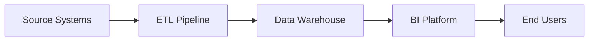
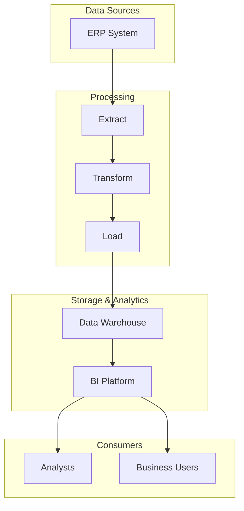

# Threat Model: ExampleAnalytics Pipeline — Data Warehouse Integration

<!-- This is a FICTIONAL example assessment demonstrating the Type 2: Internal Application methodology. All system names, data, and scenarios are fictitious. -->

---

## Document Control

| Field | Value |
|-------|-------|
| **Version** | 1.0 |
| **Assessment Date** | 2026-02-01 |
| **Assessor** | Security Architecture Team |
| **Business Owner** | [Example Organization] Data Engineering |
| **Status** | Final |

---

## 1. Assessment Overview

| Field | Value |
|-------|-------|
| **Assessment Type** | Type 2: Internal Application |
| **System** | ExampleAnalytics Pipeline (ExampleSource → ExampleTransform → ExampleWarehouse → ExampleBI) |
| **Service/Product** | Multi-stage data integration pipeline |
| **Integration Partners** | ExampleSource (ERP), ExampleTransform (ETL), ExampleWarehouse (Analytics), ExampleBI (Visualization) |
| **Assessment Date** | 2026-02-01 |
| **Assessor** | Security Architecture Team |
| **Business Owner** | [Example Organization] Data Engineering |
| **Risk Rating** | **Medium** |
| **Assessment Mode** | Baseline |
| **Prior Baseline Reference** | N/A (Baseline assessment) |
| **Regulatory Context** | None |

> **Note:** This is a fictional example demonstrating the threat modeling methodology. All systems, data types, and scenarios are fictitious.

---

## 2. Risk Management Summary

### Critical Findings

| Finding ID | Vulnerability | Threat ID | Threat Scenario | Risk Level |
|------------|---------------|-----------|-----------------|------------|
| ⚠️ **TM-001** | Weak service account management; credential rotation not automated | T-001 | Attacker compromises service account credentials to access pipeline data | High |
| 🔗 **TM-002** | Inter-service communication not consistently encrypted | T-002 | Man-in-the-middle intercepts unencrypted data flow | Medium |
| 🛡️ **TM-003** | Development and production environments share underlying infrastructure | T-003 | Developer accidentally or maliciously accesses production data | Medium |

### Risk Level Breakdown

| Category | Category Rating | Key Drivers |
|----------|-----------------|-------------|
| Data Security | **Medium** | Service account risks, encryption gaps |
| Infrastructure | **Medium** | Shared environments, cloud dependencies |
| Personnel | **Low** | Standard access controls, training |
| Business Continuity | **Low** | Documented failover procedures |

---

## 3. System Profile and Context

### System Architecture Overview

| Attribute | Value |
|-----------|-------|
| **System Type** | Data pipeline / ETL workflow |
| **Deployment Model** | Cloud-native (multi-cloud SaaS) |
| **Primary Technology Stack** | REST APIs, cloud-native orchestration |
| **Source Code Repository** | [Organization VCS] |
| **Vendor Dependencies** | 4 SaaS vendors in chain |
| **Cloud Provider** | Multiple (ExampleCloud) |

### Service Integration Summary

| Attribute | Value |
|-----------|-------|
| **Service Type** | SaaS-to-SaaS Integration |
| **Integration Method** | REST APIs, service accounts |
| **Service Criticality** | **Business-Critical** |
| **Users Affected** | Data analysts, Business intelligence users |
| **Data Sensitivity** | **Medium** (business data, metrics) |

---

## 4. Asset & Data Flow Analysis

### Data Classification Matrix

| Data Type | Volume | Sensitivity | Retention | Primary System | Regulatory Driver |
|-----------|--------|-------------|-----------|----------------|-------------------|
| Transaction Records | High | Medium | 7 years | ExampleSource | Internal Policy |
| Aggregated Metrics | Medium | Low | 3 years | ExampleWarehouse | Internal Policy |
| Report Outputs | Low | Low | 1 year | ExampleBI | Internal Policy |

### Data Flow Summary

```
[ExampleSource ERP] ---> [ExampleTransform ETL] ---> [ExampleWarehouse] ---> [ExampleBI]
     |                              |                          |                   |
  Extract                     Transform                  Load            Visualize
```

| Flow | Direction | Data Types | Protocol |
|------|-----------|------------|----------|
| ExampleSource → ExampleTransform | Outbound | Transaction data | HTTPS |
| ExampleTransform → ExampleWarehouse | Outbound | Transformed data | HTTPS |
| ExampleWarehouse → ExampleBI | Outbound | Aggregated data | HTTPS |

---

## 5. Top Priority Risks

| Threat ID | Threat | Likelihood | Impact | Risk Level | MITRE ATT&CK | Mitigating Requirement |
|-----------|--------|------------|--------|------------|--------------|---------------------|
| T-001 | Attacker compromises service account credentials | Medium | High | **High** | T1078 | Implement automated credential rotation |
| T-002 | Man-in-the-middle intercepts unencrypted data flow | Low | High | **Medium** | T1557 | Enforce TLS 1.3 for all inter-service communication |
| T-003 | Developer accidentally accesses production data | Medium | Medium | **Medium** | T1078 | Implement environment isolation |

---

## 6. Ongoing Risk Management

### Mitigating Requirements

**Technical**

1. Implement automated service account credential rotation (90-day maximum)
2. Enforce TLS 1.3 minimum for all API communications
3. Separate development and production environments with network isolation
4. Implement data access logging for all pipeline stages

**Operational**

1. Quarterly access review for service accounts
2. Annual penetration testing of pipeline endpoints
3. Documented incident response procedures for pipeline compromises

### Key Monitoring Points

| Monitoring Area | Recommendation | Frequency |
|-----------------|----------------|-----------|
| Service Account Usage | Monitor for anomalous access patterns | Real-time |
| Encryption Status | Verify TLS configuration | Weekly |
| Environment Separation | Audit cross-environment access | Monthly |

---

## 7. Assessment Sources and Methodology

### Information Sources

1. **ExampleSource Documentation** — API and integration documentation
2. **ExampleWarehouse Security Whitepaper** — Platform security controls
3. **MITRE ATT&CK** — Cloud and application technique mapping

### Assessment Confidence Levels

| Assessment Area | Confidence | Source |
|-----------------|------------|--------|
| Service Account Configuration | High | Direct review |
| Encryption Status | Medium | Vendor documentation |
| Environment Isolation | Low | Inferred from architecture |

**Overall Confidence Level:** Medium — Based on vendor documentation and architectural review; direct security testing not performed.

---

## Appendix A: Architecture Diagrams

### Context Diagram



### Container Diagram



---

*This is a fictional example assessment for demonstration purposes only. All systems, data types, and scenarios are fictitious.*
