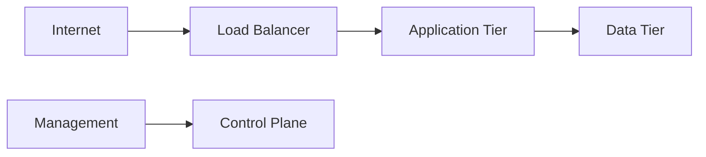
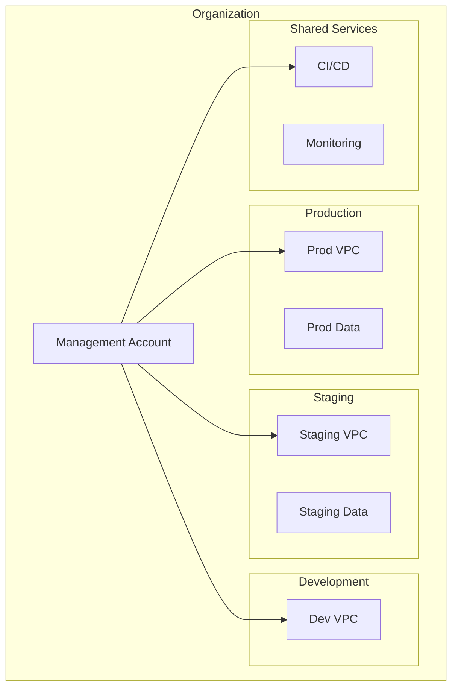

# Threat Model: ExampleCloud Infrastructure — Multi-Account Posture

<!-- This is a FICTIONAL example assessment demonstrating the Type 3: Infrastructure-Only methodology. All infrastructure details and scenarios are fictitious. -->

---

## Document Control

| Field | Value |
|-------|-------|
| **Version** | 1.0 |
| **Assessment Date** | 2026-01-20 |
| **Assessor** | Security Architecture Team |
| **Business Owner** | [Example Organization] Infrastructure Team |
| **Status** | Final |

---

## 1. Assessment Overview

| Field | Value |
|-------|-------|
| **Assessment Type** | Type 3: Infrastructure-Only |
| **System** | ExampleCloud Multi-Account Infrastructure |
| **Cloud Provider** | ExampleCloud Platform |
| **Accounts/Scope in Scope** | Production, Staging, Development, Shared Services |
| **Assessment Date** | 2026-01-20 |
| **Assessor** | Security Architecture Team |
| **Business Owner** | [Example Organization] Infrastructure Team |
| **Risk Rating** | **High** |
| **Assessment Mode** | Baseline |
| **Prior Baseline Reference** | N/A (Baseline assessment) |
| **Regulatory Context** | None |

> **Note:** This is a fictional example demonstrating the threat modeling methodology. All infrastructure details and scenarios are fictitious.

---

## 2. Risk Management Summary

### Critical Findings

| Finding ID | Vulnerability | Threat ID | Threat Scenario | Risk Level |
|------------|---------------|-----------|-----------------|------------|
| ⚠️ **TM-001** | Overprivileged IAM roles with broader permissions than required | T-001 | Attacker exploits overprivileged service role to access production data | High |
| 🔗 **TM-002** | Management endpoints accessible from public internet | T-002 | Attacker compromises management endpoint via public internet | High |
| 🛡️ **TM-003** | Cloud audit logs not centralized or monitored | T-003 | Unauthorized access undetected due to logging gaps | Medium |

### Risk Level Breakdown

| Category | Category Rating | Key Drivers |
|----------|-----------------|-------------|
| Identity & Access | **High** | Overprivileged roles, lack of MFA enforcement |
| Network Security | **Medium** | Public endpoints, insufficient segmentation |
| Data Protection | **Low** | Encryption at rest and in transit enabled |
| Monitoring | **Medium** | Logging gaps, no centralized SIEM |
| Business Continuity | **Low** | Documented DR procedures, multi-region deployment |

---

## 3. Infrastructure Scope Overview

| Attribute | Value |
|-----------|-------|
| **Cloud Provider(s)** | ExampleCloud Platform |
| **Account(s) in Scope** | prod-account, staging-account, dev-account, shared-account |
| **Region(s)** | us-example-1, us-example-2 |
| **IaC Tooling** | ExampleTerraform |
| **Network Architecture** | 4 VPCs with peering, transit gateway |
| **Public Attack Surface** | 12 internet-facing services |

### Service Integration Summary

| Attribute | Value |
|-----------|-------|
| **Service Type** | Infrastructure-as-a-Service |
| **Integration Method** | IAM federation, VPC peering, API access |
| **Service Criticality** | **Mission-Critical** |
| **Users Affected** | Development teams, Operations staff |
| **Data Sensitivity** | **High** (hosts production applications) |

---

## 4. Asset & Data Flow Analysis

### Infrastructure Inventory

| Resource Type | Count | Sensitivity | Notes |
|---------------|-------|-------------|-------|
| Compute Instances | 45 | High | Production workloads |
| Object Storage Buckets | 12 | High | Application data |
| Database Instances | 8 | Critical | Customer data |
| Network Gateways | 6 | Medium | Transit, VPN |
| IAM Roles | 34 | High | Service access |

### Access Vectors

| Vector | Description |
|--------|-------------|
| **Network Access** | VPC peering between accounts; public internet for management |
| **Authentication** | IAM user accounts; service account keys; SSO federation |
| **Authorization Levels** | Admin, Developer, ReadOnly service roles |
| **Access Duration** | Long-lived credentials for services; session-based for humans |

---

## 5. Top Priority Risks

| Threat ID | Threat | Likelihood | Impact | Risk Level | MITRE ATT&CK | Mitigating Requirement |
|-----------|--------|------------|--------|------------|--------------|---------------------|
| T-001 | Attacker exploits overprivileged service role to access production data | Medium | High | **High** | T1078 | Implement least-privilege IAM policies |
| T-002 | Attacker compromises management endpoint via public internet | Medium | High | **High** | T1190 | Restrict management access to corporate network |
| T-003 | Unauthorized access undetected due to logging gaps | Medium | Medium | **Medium** | T1562 | Implement centralized log aggregation and monitoring |

---

## 6. Ongoing Risk Management

### Mitigating Requirements

**Technical**

1. Implement least-privilege IAM policies for all service accounts
2. Restrict management endpoint access to authorized IP ranges only
3. Enable centralized logging to ExampleSIEM platform
4. Implement automated security scanning for infrastructure changes

**Operational**

1. Quarterly IAM access review and recertification
2. Monthly vulnerability scanning of internet-facing assets
3. Annual penetration testing of cloud infrastructure
4. Documented incident response procedures for cloud compromises

### Key Monitoring Points

| Monitoring Area | Recommendation | Frequency |
|-----------------|----------------|-----------|
| IAM Policy Changes | Alert on privilege escalation | Real-time |
| Failed Authentication | Monitor for brute force attempts | Real-time |
| Public Exposure | Scan for unauthorized public resources | Weekly |
| Compliance Drift | Verify against ExampleCloud Security Benchmark | Monthly |

---

## 7. Assessment Sources and Methodology

### Information Sources

1. **ExampleCloud Security Benchmark** — Cloud provider security guidelines
2. **Infrastructure as Code Repository** — ExampleTerraform configurations
3. **IAM Policy Audit** — Automated policy analysis report
4. **MITRE ATT&CK Cloud Matrix** — Cloud-specific threat techniques

### Assessment Confidence

| Assessment Area | Confidence | Source |
|-----------------|------------|--------|
| IAM Configuration | High | Direct API queries |
| Network Architecture | High | IaC review |
| Public Exposure | Medium | Automated scanning |
| Monitoring Gaps | High | Configuration review |

---

## Appendix A: Architecture Diagrams

### Context Diagram

### Account Structure Diagram

---

*This is a fictional example assessment for demonstration purposes only. All infrastructure details and scenarios are fictitious.*
