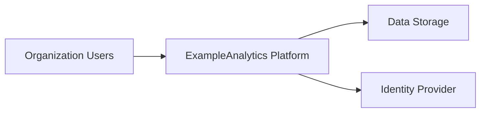
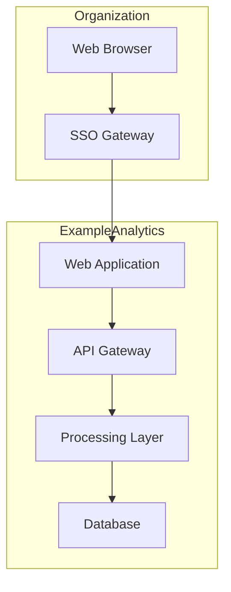

# Third Party Threat Model: ExampleCorp — SaaS Analytics Platform

<!-- This is a FICTIONAL example assessment demonstrating the Type 1: Third-Party Vendor methodology. All company names, data, and scenarios are fictitious. -->

---

## Document Control

| Field | Value |
|-------|-------|
| **Version** | 1.0 |
| **Assessment Date** | 2026-01-15 |
| **Assessor** | Security Architecture Team |
| **Business Owner** | [Example Organization] |
| **Status** | Final |

---

## 1. Assessment Overview

| Field | Value |
|-------|-------|
| **Assessment Type** | Type 1: Third-Party Vendor |
| **Vendor** | ExampleCorp, Inc. |
| **Service/Product** | ExampleAnalytics — Business intelligence and analytics platform |
| **Integration Partners** | ExampleDatabase, ExampleStorage, ExampleIdentity |
| **Assessment Date** | 2026-01-15 |
| **Risk Rating** | **Medium** |
| **Vendor Recommendation** | **Proceed with Conditions** |

> **Note:** This is a fictional example demonstrating the threat modeling methodology. All organizations, data types, and scenarios are fictitious.

---

## 2. Risk Management Summary

### Critical Findings

| Finding ID | Vulnerability | Threat ID | Threat Scenario | Risk Level |
|------------|---------------|-----------|-----------------|------------|
| ⚠️ **TM-001** | Single-factor authentication for administrative access | T-001 | Attacker compromises admin credentials via phishing | High |
| 📋 **TM-002** | Data residency controls not explicitly defined | T-008 | Regulatory compliance gap for multi-national data storage | Medium |
| 🔗 **TM-003** | API rate limiting insufficient for production workloads | T-003 | Denial of service via API abuse | Medium |
| 👤 **TM-004** | Excessive insider privileges without oversight | T-002 | Vendor insider accesses customer data without business need | Medium |

### Risk Level Breakdown

| Category | Category Rating | Key Drivers |
|----------|-----------------|-------------|
| Data Security | **Medium** | Encryption in transit and at rest; MFA gaps |
| Infrastructure | **Medium** | Cloud-native architecture; shared responsibility |
| Personnel | **Low** | Vendor background checks; security training |
| Business Continuity | **Medium** | 99.9% SLA; documented DR procedures |

---

## 3. Vendor Profile and Context

### Company Intelligence

| Attribute | Value |
|-----------|-------|
| **Founded** | 2015 |
| **Employees** | ~500 |
| **Headquarters** | Example City, Example Country |
| **Ownership** | Private (ExampleVentures backing) |
| **Cloud Provider** | AWS / Azure / GCP |
| **Compliance** | SOC 2 Type II, ISO 27001 |

### Service Integration Summary

| Attribute | Value |
|-----------|-------|
| **Service Type** | SaaS (multi-tenant cloud platform) |
| **Integration Method** | REST API, SAML 2.0 SSO, webhook callbacks |
| **Service Criticality** | **Business-Critical** |
| **Users Affected** | Analytics team, Business stakeholders |
| **Data Sensitivity** | **Medium** (business metrics, aggregate data) |

---

## 4. Asset & Data Flow Analysis

### Data Classification Matrix

| Data Type | Volume | Sensitivity | Retention | Regulatory Driver |
|-----------|--------|-------------|-----------|-------------------|
| Business Metrics | High | Medium | 3 years | Internal Policy |
| Aggregate Reports | Medium | Low | 1 year | Internal Policy |
| User Analytics | Low | Medium | 2 years | Internal Policy |

### Data Flow Summary

| Flow | Direction | Data Types | Protocol |
|------|-----------|------------|----------|
| [Organization] → ExampleAnalytics | Outbound | Business data | HTTPS/TLS 1.3 |
| ExampleAnalytics → [Storage] | Outbound | Processed results | HTTPS |

---

## 5. Top Priority Risks

| Threat ID | Threat | Likelihood | Impact | Risk Level | MITRE ATT&CK | Mitigating Requirement |
|-----------|--------|------------|--------|------------|--------------|---------------------|
| T-001 | External attacker compromises admin credentials | Medium | High | **High** | T1078 | Implement MFA for all administrative access |
| T-002 | Insider with excessive privileges accesses customer data | Medium | Medium | **Medium** | T1078.004 | Implement principle of least privilege; role-based access controls |
| T-003 | API abuse causes service degradation | Medium | Medium | **Medium** | T1498 | Implement rate limiting and monitoring |
| T-008 | Data replication to non-approved regions via API | Medium | Medium | **Medium** | N/A | Configure data residency controls; document approved regions |

---

## 6. Ongoing Risk Management

### Mitigating Requirements

**Technical**

1. Implement multi-factor authentication for all administrative accounts
2. Enable API rate limiting with appropriate thresholds
3. Configure data residency controls to restrict storage regions

**Operational**

1. Review vendor security documentation annually
2. Monitor API usage for anomalous patterns
3. Maintain incident response contact information

### Key Monitoring Points

| Monitoring Area | Recommendation | Frequency |
|-----------------|----------------|-----------|
| Access Logs | Review administrative access | Weekly |
| API Metrics | Monitor rate limiting effectiveness | Real-time |
| Compliance | Verify SOC 2 certification status | Annual |

---

## 7. Assessment Sources and Methodology

### Information Sources

1. **ExampleCorp Trust Documentation** — Vendor-provided security whitepaper
2. **API Documentation** — Public API reference documentation
3. **MITRE ATT&CK** — [attack.mitre.org](https://attack.mitre.org) — Threat technique mapping

### Assessment Confidence

| Assessment Area | Confidence | Source |
|-----------------|------------|--------|
| Vendor Profile | High | Public documentation |
| Technical Controls | Medium | Vendor attestation |
| Integration Architecture | High | Documentation review |

**Overall Confidence Level:** Medium — Assessment based on vendor documentation and standard integration patterns.

---

## Appendix A: Architecture Diagrams

### Context Diagram

### Container Diagram

---

*This is a fictional example assessment for demonstration purposes only. All organizations, scenarios, and data are fictitious.*
