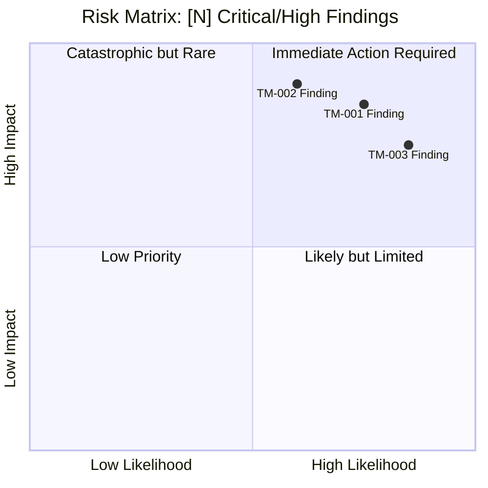
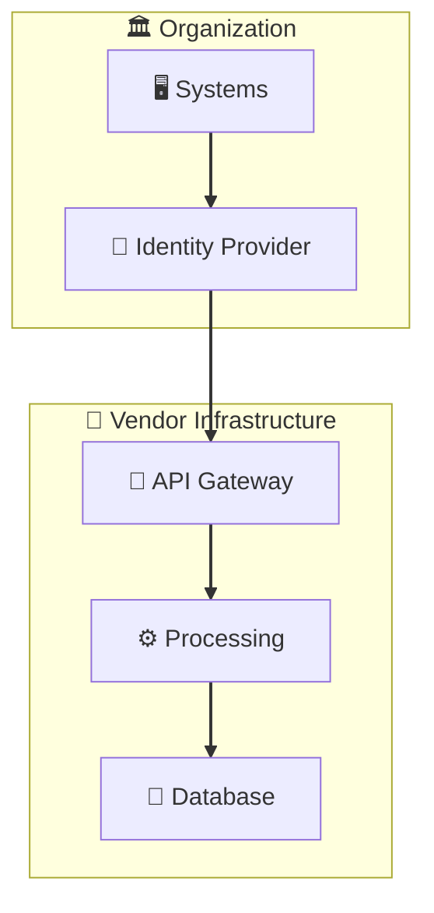

# Third-Party Vendor Threat Model: [Vendor Name] — [Context]

<!-- Replace frontmatter values above and delete this comment block
     [Vendor Name] = vendor name (e.g., "ExampleCRM")
     [Context] = use case or service description
     This template is for Type 1: Third-Party Vendor assessments -->

---

## Document Control

*Metadata for version tracking and accountability.*

| Field | Value |
|-------|-------|
| **Version** | [1.0] |
| **Assessment Date** | [YYYY-MM-DD] |
| **Assessor** | [Name / Role] |
| **Business Owner** | [Name / Title] |
| **Status** | [Draft / Draft-Reviewed / Final] |
| **Prior Baseline Reference** | [Link to prior baseline, if Re-baseline] |

> **Source Age Notice:** Assessment sources have access dates documented in Section 7. Source age affects confidence levels.

---

## Executive Summary

*Leadership-focused urgent action statement with vendor risk context and recommendation impact.*

### Executive Action Required

\begin{center}
\textbf{\large Executive Action Required}
\end{center}

**[Number] critical findings** in the [Vendor Name] assessment [support/constrain] the proposed vendor relationship. [One-sentence summary of combined risk]. The **Vendor Recommendation** of **[Proceed / Proceed with Conditions / Do Not Proceed]** reflects these findings. Immediate executive attention is required to [action — e.g., "approve conditional onboarding with mandatory mitigations" / "evaluate alternative vendors" / "confirm risk acceptance for identified gaps"].

### Security & Compliance Context

[2-3 paragraphs covering:]
- **Vendor ecosystem risk:** Supply chain implications, data residency concerns, fourth-party exposure
- **Regulatory implications:** Frameworks requiring vendor due diligence (HIPAA BAA, GDPR Article 28, SOC 2 CC9.2, etc.)
- **Business impact:** Contract value, integration criticality, switching costs

> **Regulatory Context:** [Cite specific regulations applicable to this assessment with links to authoritative sources. E.g., "HIPAA Security Rule — 45 CFR 164.312: https://www.ecfr.gov/current/title-45/part-164"]

> **Research Citation:** [For high-sensitivity assessments, cite relevant incident research: "[Breach/incident description] [Source: public reporting, access date YYYY-MM-DD]"]

> **Note:** Source age and access dates are tracked in Section 7. Assess confidence accordingly.

### Risk Quadrant Chart

*Plot Critical findings (0.7+ impact) mandatorily. Plot High findings (0.5-0.7 impact) if space permits.*

---

## 1. Assessment Overview

*Key facts about this assessment in a single scannable table.*

| Field | Value |
|-------|-------|
| **Assessment Type** | Type 1: Third-Party Vendor |
| **Vendor** | [Vendor name] |
| **Service/Product** | [Service, product, or system being assessed] |
| **Integration Partners** | [Other vendors/systems in the data flow, if any — or "None"] |
| **Assessment Date** | [YYYY-MM-DD] |
| **Assessor** | [Name / Role] |
| **Business Owner** | [Name / Title] |
| **Risk Rating** | [Critical / High / Medium / Low] |
| **Assessment Mode** | [Baseline / Re-baseline] — *Delta mode is not available for Type 1; vendor changes require Re-baseline* |
| **Prior Baseline Reference** | [Link to prior baseline, if Delta/Re-baseline] |
| **Regulatory Context** | [HIPAA / 42 CFR Part 2 / Life-Safety Regulations / None] |
| **Vendor Recommendation** | [Proceed / Proceed with Conditions / Do Not Proceed] |

> **Vendor Recommendation Guidance:**
> - **Proceed:** Risk is acceptable; no blocking findings
> - **Proceed with Conditions:** Risk is manageable if mitigating requirements are implemented
> - **Do Not Proceed:** Unacceptable risk identified; blocking findings in Section 5

---

## 2. Risk Management Summary

*Critical findings and risk breakdown by category.*

### Critical Findings

<!-- 3-7 key findings, icon-prefixed. Every finding MUST map to a T-XXX threat scenario -->
<!-- Use emoji: ⚠️ = warning/high risk, 🛡️ = security control, 🔗 = integration, 📋 = compliance, 👤 = personnel -->

| Finding ID | Vulnerability | Threat ID | Threat Scenario | Risk Level |
|------------|---------------|-----------|-----------------|------------|
| ⚠️ **TM-001** | [Vulnerability description] | T-001 | [Attacker action exploiting this vulnerability] | High |
| 📋 **TM-002** | [Compliance/accountability gap] | T-002 | [How gap enables threat actor] | High |
| 👤 **TM-003** | [Personnel/insider gap] | T-003 | [Insider threat scenario] | High |

> **Note on Accountability Gaps:** Findings like "Unknown Business Owner" ARE threat-rooted. The threat scenario is: "Malicious insider exploits lack of oversight to compromise CIA of data/services." Map these to T-XXX threats per the Threat-Rooted Findings Requirement.
>
> **Compliance Outputs vs. Findings:** Sector-specific reporting obligations (e.g., HHS for healthcare) are **OUTPUTS** of threat modeling, not findings. They apply to TM-XXX findings with technical threat roots.

### Risk Level Breakdown

| Category | Category Rating | Key Drivers |
|----------|-----------------|-------------|
| Data Security | [Critical/High/Medium/Low] | [Primary risk drivers] |
| Infrastructure | [Critical/High/Medium/Low] | [Primary risk drivers] |
| Personnel | [Critical/High/Medium/Low] | [Primary risk drivers] |
| Business Continuity | [Critical/High/Medium/Low] | [Primary risk drivers] |

---

## 3. Vendor Profile and Context

*Who is being assessed and how they integrate with organizational systems.*

### Company Intelligence

| Attribute | Value |
|-----------|-------|
| **Founded** | [Year] |
| **Employees** | [Count or estimate] |
| **Headquarters** | [City, State/Country] |
| **Ownership** | [Public / Private — PE-backed, VC-backed, etc.] |
| **Revenue** | [Amount or "Not disclosed"] |
| **Cloud Provider** | [AWS / Azure / GCP / Private] |
| **Compliance** | [SOC 2, ISO 27001, HIPAA, FedRAMP, etc.] |
| **Recent News/Concerns** | [Acquisitions, incidents, leadership changes — or "None identified"] |

### Service Integration Summary

| Attribute | Value |
|-----------|-------|
| **Service Type** | [SaaS / API / On-prem / Hybrid] |
| **Integration Method** | [REST API, SSO, file transfer, etc.] |
| **Service Criticality** | [Life-Safety / Mission-Critical / Business-Critical / Operational] |
| **Users Affected** | [Description and count] |
| **Data Sensitivity** | [Critical / High / Medium / Low] |

---

## 4. Asset & Data Flow Analysis

*What data is at risk, how it moves, and how it is accessed. See Appendix A for architecture diagrams.*

### Data Classification Matrix

| Data Type | Volume | Sensitivity | Retention | Regulatory Driver | Source Age |
|-----------|--------|-------------|-----------|-------------------|------------|
| [Data type] | [High/Med/Low] | [Critical/High/Med/Low] | [Duration + basis] | [Regulation or "Baseline"] | [YYYY-MM-DD] |
| [Data type] | [High/Med/Low] | [Critical/High/Med/Low] | [Duration + basis] | [Regulation or "Baseline"] | [YYYY-MM-DD] |

> **Source Age Note:** Data inventory reflects state as of [date]. Retention periods and classifications may have changed. Validate current data types against [source: e.g., "A4 Data Inventory"] before relying on classification for risk scoring.

> **Retention Clarification:** [If applicable: "Retention periods specified reflect [business policy / regulatory requirement / contractual obligation]. Exceeding retention without legal hold increases breach impact multiplicatively."]

### Data Flow Summary

| Flow | Direction | Data Types | Protocol |
|------|-----------|------------|----------|
| [Organization] → [Vendor] | Outbound | [Data types] | [HTTPS/SFTP/etc.] |
| [Vendor] → [Organization] | Inbound | [Data types] | [HTTPS/SFTP/etc.] |

### Access Vectors

| Vector | Description |
|--------|-------------|
| Network Access | [How network connectivity is established] |
| Authentication | [Auth mechanisms: SSO, API keys, certificates, etc.] |
| Authorization Levels | [Access levels and permissions] |
| Access Duration | [Ongoing / Time-limited / On-demand] |

---

## 5. Top Priority Risks

*High-rated threats requiring management attention.*

| Threat ID | Threat | Likelihood | Impact | Risk Level | MITRE ATT&CK | Mitigating Requirement |
|-----------|--------|------------|--------|------------|---------------|---------------------|
| T-001 | [Threat description] | [H/M/L] | [H/M/L] | **High** | [Technique ID] | [Mitigating requirement] |
| T-002 | [Threat description] | [H/M/L] | [H/M/L] | **High** | [Technique ID] | [Mitigating requirement] |

---

## 6. Ongoing Risk Management

*Mitigating requirements and monitoring considerations.*

### Mitigating Requirements

**Technical**

1. [Mitigation description]
2. [Mitigation description]

**Operational**

1. [Mitigation description]
2. [Mitigation description]

### Key Monitoring Points

| Monitoring Area | Recommendation | Frequency |
|-----------------|----------------|-----------|
| [Area] | [What to monitor] | [Real-time / Daily / Monthly / Quarterly / Annual] |

---

## 7. Assessment Sources and Methodology

*Where assessment information came from and how confident we are in it.*

### Information Sources

<!-- Cite sources using footnote pattern for traceability: [^1], [^2] -->

| Source | URL | Access Date | Key Finding | Citation |
|--------|-----|-------------|-------------|----------|
| **[Source name]** | [URL](https://example.com) | [YYYY-MM-DD] | [Brief description] | [^1] |
| **[Source name]** | [URL](https://example.com) | [YYYY-MM-DD] | [Brief description] | [^2] |

<!-- Add footnote references at end of document or per-section -->

[^1]: [Full citation: Author/Organization, Title, Date, URL, access date]
[^2]: [Full citation: Author/Organization, Title, Date, URL, access date]

### Assessment Confidence Levels

| Assessment Area | Confidence | Source |
|-----------------|------------|--------|
| [Area] | [High/Medium/Low] | [Source type] |

**Overall Confidence Level:** [High/Medium/Low] — [One-sentence justification]

---

## Appendix A: Architecture Diagrams

*Architecture diagrams referenced from Section 4.*

### Context Diagram

### Container Diagram

<!-- Recommended if service criticality is Business-Critical or higher -->

---

*Document generated using Threat Modeling Framework v5.0*
