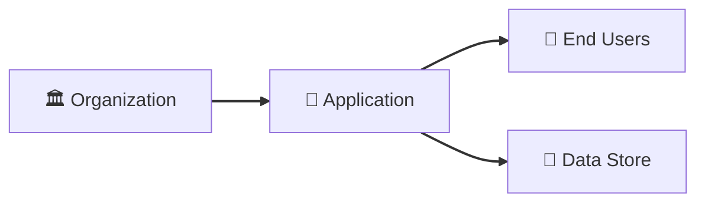
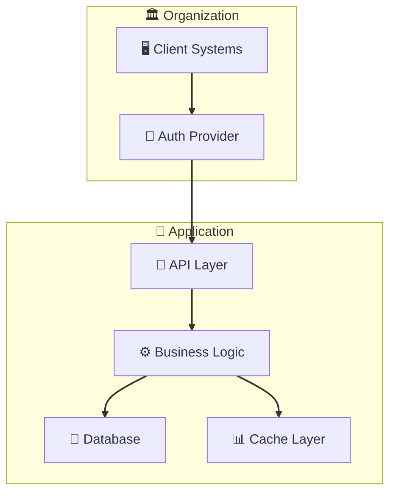

# Threat Model: [System Name] — [Context]

<!-- Replace [System Name] with the system or pipeline name (e.g., "Financial Data Pipeline")
     Replace [Context] with the use case or service description (e.g., "ETL for Analytics")
     This template is for Type 2: Internal Application assessments -->

---

## Document Control

*Metadata for version tracking and accountability.*

| Field | Value |
|-------|-------|
| **Version** | [1.0] |
| **Assessment Date** | [YYYY-MM-DD] |
| **Assessor** | [Name / Role] |
| **Business Owner** | [Name / Title] |
| **Status** | [Draft / Draft-Reviewed / Final] |

---

## 1. Assessment Overview

*Key facts about this assessment in a single scannable table.*

| Field | Value |
|-------|-------|
| **Assessment Type** | Type 2: Internal Application |
| **System** | [System name] |
| **Service/Product** | [Application, pipeline, or service being assessed] |
| **Integration Partners** | [Vendors/systems in the data flow, if any — or "None"] |
| **Assessment Date** | [YYYY-MM-DD] |
| **Assessor** | [Name / Role] |
| **Business Owner** | [Name / Title] |
| **Risk Rating** | [Critical / High / Medium / Low] |
| **Assessment Mode** | [Baseline / Delta / Re-baseline] |
| **Prior Baseline Reference** | [Link to prior baseline, if Delta/Re-baseline] |
| **Regulatory Context** | [HIPAA / 42 CFR Part 2 / Life-Safety Regulations / None] |

---

## 2. Risk Management Summary

*Critical findings and risk breakdown by category.*

### Critical Findings

<!-- 3-7 key findings, icon-prefixed. Every finding MUST map to a T-XXX threat scenario -->
<!-- Use emoji: ⚠️ = warning/high risk, 🛡️ = security control, 🔗 = integration, 📋 = compliance, 👤 = personnel -->

| Finding ID | Vulnerability | Threat ID | Threat Scenario | Risk Level |
|------------|---------------|-----------|-----------------|------------|
| ⚠️ **TM-001** | [Vulnerability description] | T-001 | [Attacker action exploiting this vulnerability] | High |
| 📋 **TM-002** | [Compliance/accountability gap] | T-002 | [How gap enables threat actor] | High |
| 👤 **TM-003** | [Personnel/insider gap] | T-003 | [Insider threat scenario] | High |

> **Note on Accountability Gaps:** Findings like "Unknown Business Owner" ARE threat-rooted. The threat scenario is: "Malicious insider exploits lack of oversight to compromise CIA of data/services." Map these to T-XXX threats.
>
> **Compliance Outputs vs. Findings:** Sector-specific reporting obligations (e.g., HHS for healthcare) are **OUTPUTS** of threat modeling, not findings. They apply to TM-XXX findings with technical threat roots.

### Risk Level Breakdown

| Category | Category Rating | Key Drivers |
|----------|-----------------|-------------|
| Data Security | [Critical/High/Medium/Low] | [Primary risk drivers] |
| Infrastructure | [Critical/High/Medium/Low] | [Primary risk drivers] |
| Personnel | [Critical/High/Medium/Low] | [Primary risk drivers] |
| Business Continuity | [Critical/High/Medium/Low] | [Primary risk drivers] |

---

## 3. System Profile and Context

*What is being assessed and how it integrates with organizational systems.*

### System Architecture Overview

| Attribute | Value |
|-----------|-------|
| **System Type** | [Custom app / Data pipeline / Internal service / Multi-vendor chain] |
| **Deployment Model** | [Cloud-native / Hybrid / On-premises] |
| **Primary Technology Stack** | [Languages, frameworks, platforms] |
| **Source Code Repository** | [Location or N/A] |
| **Vendor Dependencies** | [List any external vendors in the architecture, or "None"] |
| **Cloud Provider** | [AWS / Azure / GCP / Private / Multiple] |
| **Recent Changes** | [Architectural changes, migrations, incidents — or "None"] |

### Service Integration Summary

| Attribute | Value |
|-----------|-------|
| **Service Type** | [API / Pipeline / Web app / Integration] |
| **Integration Method** | [REST API, message queue, file transfer, etc.] |
| **Service Criticality** | [Life-Safety / Mission-Critical / Business-Critical / Operational] |
| **Users Affected** | [Description and count] |
| **Data Sensitivity** | [Critical / High / Medium / Low] |

---

## 4. Asset & Data Flow Analysis

*What data is at risk, how it moves, and how it is accessed. See Appendix A for architecture diagrams.*

### Data Classification Matrix

| Data Type | Volume | Sensitivity | Retention | Primary System | Regulatory Driver |
|-----------|--------|-------------|-----------|----------------|-------------------|
| [Data type] | [High/Med/Low] | [Critical/High/Med/Low] | [Duration + basis] | [System name] | [Regulation or "Baseline"] |
| [Data type] | [High/Med/Low] | [Critical/High/Med/Low] | [Duration + basis] | [System name] | [Regulation or "Baseline"] |

### Data Flow Summary

| Flow | Direction | Data Types | Protocol |
|------|-----------|------------|----------|
| [Source] → [Destination] | [Inbound/Outbound/Bidirectional] | [Data types] | [HTTPS/SFTP/etc.] |
| [Source] → [Destination] | [Inbound/Outbound/Bidirectional] | [Data types] | [HTTPS/SFTP/etc.] |

### Access Vectors

| Vector | Description |
|--------|-------------|
| Network Access | [How network connectivity is established] |
| Authentication | [Auth mechanisms: SSO, API keys, certificates, etc.] |
| Authorization Levels | [Access levels and permissions] |
| Access Duration | [Ongoing / Time-limited / On-demand] |

---

## 5. Top Priority Risks

*High-rated threats requiring management attention.*

| Threat ID | Threat | Likelihood | Impact | Risk Level | MITRE ATT&CK | Mitigating Requirement |
|-----------|--------|------------|--------|------------|---------------|---------------------|
| T-001 | [Threat description] | [H/M/L] | [H/M/L] | **High** | [Technique ID] | [Mitigating requirement] |
| T-002 | [Threat description] | [H/M/L] | [H/M/L] | **High** | [Technique ID] | [Mitigating requirement] |

---

## 6. Ongoing Risk Management

*Mitigating requirements and monitoring considerations.*

### Mitigating Requirements

**Technical**

1. [Mitigation description]
2. [Mitigation description]

**Operational**

1. [Mitigation description]
2. [Mitigation description]

### Key Monitoring Points

| Monitoring Area | Recommendation | Frequency |
|-----------------|----------------|-----------|
| [Area] | [What to monitor] | [Real-time / Daily / Monthly / Quarterly / Annual] |

---

## 7. Assessment Sources and Methodology

*Where assessment information came from and how confident we are in it.*

### Information Sources

1. **[Source name]** — [URL](https://example.com) — [Brief description]
2. **[Source name]** — [URL](https://example.com) — [Brief description]

### Assessment Confidence Levels

| Assessment Area | Confidence | Source |
|-----------------|------------|--------|
| [Area] | [High/Medium/Low] | [Source type] |

**Overall Confidence Level:** [High/Medium/Low] — [One-sentence justification]

---

## Appendix A: Architecture Diagrams

*Architecture diagrams referenced from Section 4.*

### Context Diagram

### Container Diagram

<!-- Recommended if service criticality is Business-Critical or higher -->

---

*Document generated using Threat Modeling Framework v4.1*
