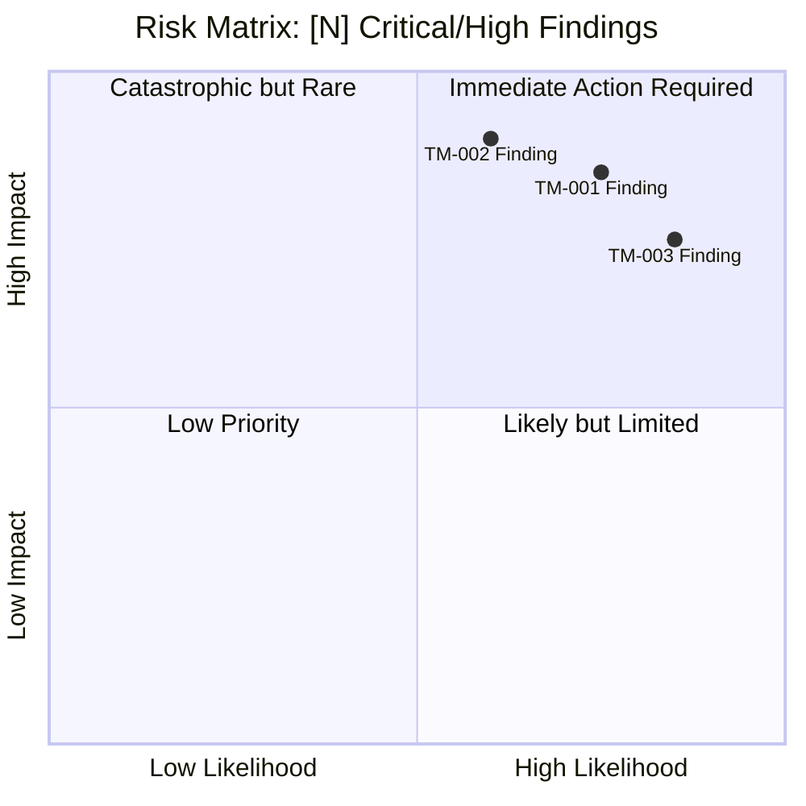
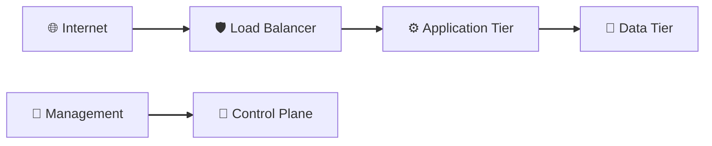
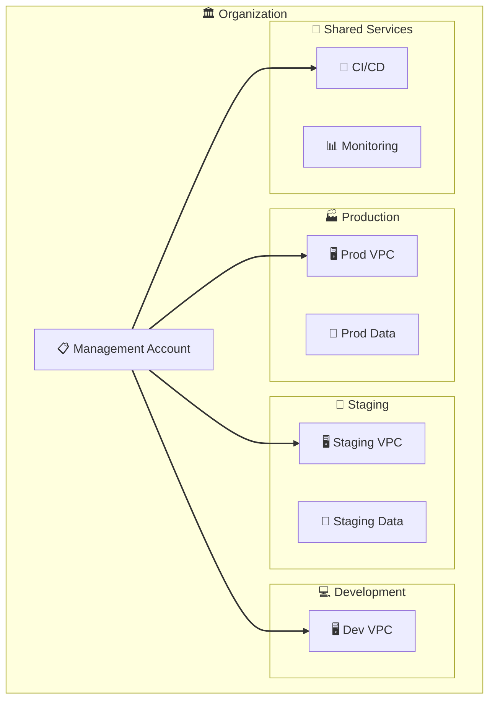

# Threat Model: [Infrastructure Scope] — [Context]

<!-- Replace [Infrastructure Scope] with the scope name (e.g., "AWS Multi-Account Posture")
     Replace [Context] with the environment or purpose (e.g., "Production Environment")
     This template is for Type 3: Infrastructure-Only assessments -->

---

## Document Control

*Metadata for version tracking and accountability.*

| Field | Value |
|-------|-------|
| **Version** | [1.0] |
| **Assessment Date** | [YYYY-MM-DD] |
| **Assessor** | [Name / Role] |
| **Business Owner** | [Name / Title] |
| **Status** | [Draft / Draft-Reviewed / Final] |

---

## Executive Summary

*Leadership-focused urgent action statement with security/compliance context and risk visualization.*

### Executive Action Required

\begin{center}
\textbf{\large Executive Action Required}
\end{center}

**[Number] critical findings** expose infrastructure [scope description] to potential compromise. [One-sentence summary of combined risk — e.g., "The combination of overprivileged IAM roles and unencrypted storage creates pathways for data exfiltration and regulatory violations"]. Left unaddressed, these vulnerabilities could expose [organization] to [specific consequences]. Immediate executive attention is required to prioritize remediation of [top 1-2 risk categories].

### Security & Compliance Context

[2-3 paragraphs covering:]
- **Regulatory implications:** Applicable frameworks (HIPAA, GDPR, SOC 2, etc.) and infrastructure-specific obligations
- **Operational impact:** Service disruption, data loss, cross-account lateral movement
- **Financial exposure:** Breach costs, compliance penalties, business interruption

### Risk Quadrant Chart

*Plot Critical findings (0.7+ impact) mandatorily. Plot High findings (0.5-0.7 impact) if space permits.*

---

## 1. Assessment Overview

*Key facts about this assessment in a single scannable table.*

| Field | Value |
|-------|-------|
| **Assessment Type** | Type 3: Infrastructure-Only |
| **System** | [Infrastructure scope being assessed] |
| **Cloud Provider** | [AWS / Azure / GCP] |
| **Accounts/Scope in Scope** | [Account IDs, regions, or scope description] |
| **Assessment Date** | [YYYY-MM-DD] |
| **Assessor** | [Name / Role] |
| **Business Owner** | [Name / Title] |
| **Risk Rating** | [Critical / High / Medium / Low] |
| **Assessment Mode** | [Baseline / Delta / Re-baseline] |
| **Prior Baseline Reference** | [Link to prior baseline, if Delta/Re-baseline] |
| **Regulatory Context** | [HIPAA / 42 CFR Part 2 / Life-Safety Regulations / None] |

---

## 2. Risk Management Summary

*Critical findings and risk breakdown by category.*

### Critical Findings

<!-- 3-7 key findings, icon-prefixed. Every finding MUST map to a T-XXX threat scenario -->
<!-- Use emoji: ⚠️ = warning/high risk, 🛡️ = security control, 🔗 = integration, 📋 = compliance, 👤 = personnel -->

| Finding ID | Vulnerability | Threat ID | Threat Scenario | Risk Level |
|------------|---------------|-----------|-----------------|------------|
| ⚠️ **TM-001** | [Vulnerability description] | T-001 | [Attacker action exploiting this vulnerability] | High |
| 📋 **TM-002** | [Configuration/Compliance gap] | T-002 | [How gap enables threat actor] | High |
| 🔗 **TM-003** | [Access control gap] | T-003 | [Lateral movement scenario] | High |

> **Note:** Findings like overprivileged IAM roles or public exposure are threat-rooted. Map to specific T-XXX threats describing exploitation.

### Risk Level Breakdown

| Category | Category Rating | Key Drivers |
|----------|-----------------|-------------|
| Identity & Access | [Critical/High/Medium/Low] | [Primary risk drivers] |
| Network Security | [Critical/High/Medium/Low] | [Primary risk drivers] |
| Data Protection | [Critical/High/Medium/Low] | [Primary risk drivers] |
| Monitoring | [Critical/High/Medium/Low] | [Primary risk drivers] |
| Business Continuity | [Critical/High/Medium/Low] | [Primary risk drivers] |

---

## 3. Infrastructure Scope Overview

*What infrastructure is being assessed.*

### Scope Definition

| Attribute | Value |
|-----------|-------|
| **Cloud Provider(s)** | [AWS / Azure / GCP] |
| **Account(s) in Scope** | [Account IDs or names] |
| **Region(s)** | [AWS regions or equivalents] |
| **IaC Tooling** | [OpenTofu / CloudFormation / Pulumi / None] |
| **Network Architecture** | [VPC count, peering, transit gateway] |
| **Public Attack Surface** | [Count of internet-facing services] |
| **Recent Changes** | [Infrastructure changes, migrations — or "None"] |

### Infrastructure Inventory

| Resource Type | Count | Sensitivity | Notes |
|---------------|-------|-------------|-------|
| Compute Instances | [N] | High | Production workloads |
| Object Storage | [N] | High | Application data |
| Database Instances | [N] | Critical | Customer data |
| Network Gateways | [N] | Medium | Transit, VPN |
| IAM Roles | [N] | High | Service access |

---

## 4. Asset & Data Flow Analysis

*Infrastructure assets and access patterns. See Appendix A for architecture diagrams.*

### Data Classification Matrix

| Data Type | Volume | Sensitivity | Storage Location | Regulatory Driver |
|-----------|--------|-------------|------------------|-------------------|
| [Data type] | [High/Med/Low] | [Critical/High/Med/Low] | [Service or bucket] | [Regulation or "Baseline"] |
| [Data type] | [High/Med/Low] | [Critical/High/Med/Low] | [Service or bucket] | [Regulation or "Baseline"] |

### Access Vectors

| Vector | Description |
|--------|-------------|
| Network Access | [VPC peering, public internet, VPN] |
| Authentication | [IAM users, roles, service accounts, SSO] |
| Authorization Levels | [Admin, Developer, ReadOnly roles] |
| Access Duration | [Long-lived credentials / Session-based] |

---

## 5. Top Priority Risks

*High-rated threats requiring management attention.*

| Threat ID | Threat | Likelihood | Impact | Risk Level | MITRE ATT&CK | Mitigating Requirement |
|-----------|--------|------------|--------|------------|---------------|---------------------|
| T-001 | [Threat description] | [H/M/L] | [H/M/L] | **High** | [Technique ID] | [Mitigating requirement] |
| T-002 | [Threat description] | [H/M/L] | [H/M/L] | **High** | [Technique ID] | [Mitigating requirement] |

---

## 6. Ongoing Risk Management

*Mitigating requirements and monitoring considerations.*

### Mitigating Requirements

**Technical**

1. [Mitigation description]
2. [Mitigation description]

**Operational**

1. [Mitigation description]
2. [Mitigation description]

### Key Monitoring Points

| Monitoring Area | Recommendation | Frequency |
|-----------------|----------------|-----------|
| [Area] | [What to monitor] | [Real-time / Daily / Monthly / Quarterly / Annual] |

---

## 7. Assessment Sources and Methodology

*Where assessment information came from and how confident we are in it.*

### Information Sources

1. **[Source name]** — [URL](https://example.com) — [Brief description]
2. **[Source name]** — [URL](https://example.com) — [Brief description]

### Assessment Confidence Levels

| Assessment Area | Confidence | Source |
|-----------------|------------|--------|
| IAM Configuration | [High/Medium/Low] | [Source type] |
| Network Architecture | [High/Medium/Low] | [Source type] |
| Public Exposure | [High/Medium/Low] | [Source type] |
| Monitoring | [High/Medium/Low] | [Source type] |

**Overall Confidence Level:** [High/Medium/Low] — [One-sentence justification]

---

## Appendix A: Architecture Diagrams

*Architecture diagrams referenced from Section 4.*

### Context Diagram

### Account Structure Diagram

<!-- Recommended for multi-account assessments -->

---

*Document generated using Threat Modeling Framework v5.0*
